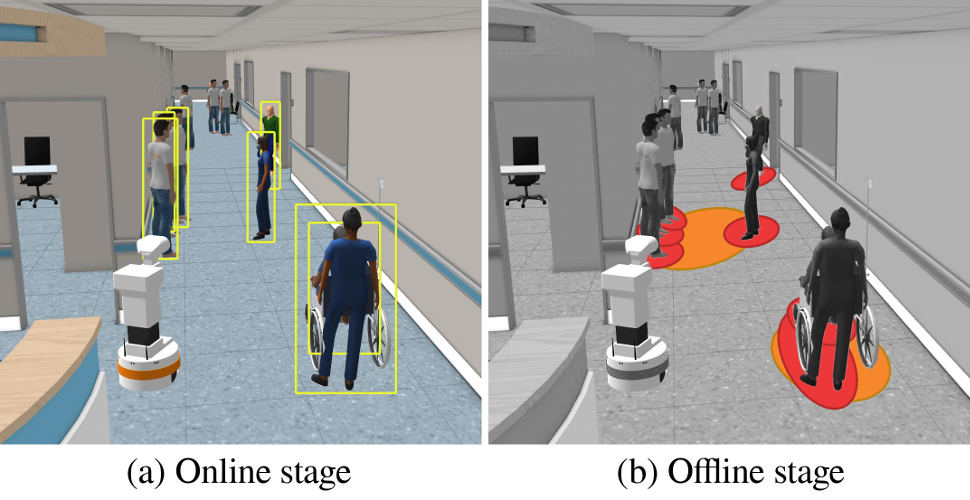

# srpb

The repository contains the source code of the SRPB - **S**ocial **R**obot navigation **P**lanners **B**enchmark.



The corresponding package that allows logging data while the robot is navigating (using ROS1 navigation stack) is available at [`srpb_move_base`](https://github.com/rayvburn/srpb_move_base).

A log file is saved once the goal is reached by the `srpb_move_base` node. Renewing the goal pose before reaching the previous one does not cause the files to be divided into parts.

A detailed description of metrics computation formulas is presented in the article [`Quantitative metrics for benchmarking human-aware robot navigation`](https://ieeexplore.ieee.org/document/10194930).

If you are using this benchmark in your research, please cite it as:

```bibtex
@article{karwowski2023quantitative,
  author={Karwowski, Jarosław and Szynkiewicz, Wojciech},
  journal={IEEE Access},
  title={Quantitative metrics for benchmarking human-aware robot navigation},
  year={2023},
  volume={},
  number={},
  pages={1-1},
  doi={10.1109/ACCESS.2023.3299178}
}
```

## Installation

Follow the steps below to clone SRPB-related packages:

```sh
cd <WS_DIR>/src
git clone --recurse-submodules git@github.com:rayvburn/srpb.git -b melodic-devel srpb/srpb
rosinstall -n . srpb/srpb/srpb.rosinstall
```

## Usage

TBD

## Acknowledgments

The package was developed on top of [`MRPB`: Mobile Robot Local Planning Benchmark](https://github.com/NKU-MobFly-Robotics/local-planning-benchmark).

## Contributing

Feel free to share your ideas, suggestions and contribute to the code development.
