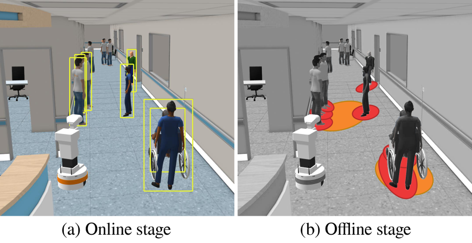

# srpb

The repository contains the source code of the SRPB - **S**ocial **R**obot **P**lanners **B**enchmark - a benchmark that allows for quantitative evaluation of robot navigation performance and social aspects.



The corresponding package that allows logging data while the robot is navigating (using ROS1 navigation stack) is available at [`srpb_move_base`](https://github.com/rayvburn/srpb_move_base).

A detailed description of metrics computation formulas is presented in the article [`Quantitative metrics for benchmarking human-aware robot navigation`](https://ieeexplore.ieee.org/document/10194930).

If you are using this benchmark in your research, please cite it as:

```bibtex
@article{karwowski2023quantitative,
  author={Karwowski, Jarosław and Szynkiewicz, Wojciech},
  journal={IEEE Access},
  title={Quantitative Metrics for Benchmarking Human-Aware Robot Navigation},
  year={2023},
  volume={11},
  number={},
  pages={79941-79953},
  doi={10.1109/ACCESS.2023.3299178}
}
```

## Installation

Follow the steps below to clone SRPB-related packages:

```sh
cd <WS_DIR>/src
git clone --recurse-submodules https://github.com/rayvburn/srpb.git -b melodic-devel srpb/srpb
rosinstall -n . srpb/srpb/srpb.rosinstall
```

## Usage

### Setup

A log file is saved once the goal is reached by the `srpb_move_base` node. Renewing the goal pose before reaching the previous one does not cause the files to be divided into parts.

### Typical workflow

If one intends to collect a bunch of logs, this is the correct workflow:

* instead of running the typical `move_base`, run the `srpb_move_base` node that aggregates the `srpb_logger` modules,
* after each trial, run the `scripts/copy_logs.sh` to copy the logs related to the newest trial into a separate directory,
* if one wishes to be extra safe, one might want to evaluate the newest logs at this point with `scripts/evaluate_from_dir.sh <PATH TO THE DIR WITH LOGS COPIED INTO>` OR (typically) once all trials were completed, run the `scripts/evaluate_all_dirs.sh <PATH TO THE MAIN DIR WITH LOGS GROUPED INTO DIRS>`,
* now an Excel sheet can be created with `python3 create_excel_from_results.py` script.

## Acknowledgments

The foundation of this package is [`MRPB`: Mobile Robot Local Planning Benchmark](https://github.com/NKU-MobFly-Robotics/local-planning-benchmark). There might be some shared sections of code, but overall, the original package has undergone a major overhaul.

## Contributing

Feel free to share your ideas, suggestions in Issues. Contributing to the code development is also appreciated.
